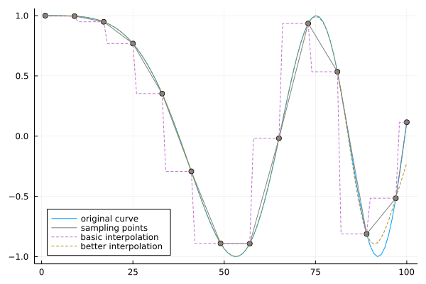

# SampledVectors.jl
`SampledVector` is a vector of finite length, but can push elements into it infinitely. When you push in a new element and exceed the maximum length limit, it will be automatically downsampled. `SampledVector` can be used to record metrics, such as training loss curve in machine learning.
```julia
using Plots
y = [cos(x^2/900) for x in 1:100]
plot(y, label="original curve")

using SampledVectors
vector = SampledVector{Float64}(20) #20 is the actual maximum length in memory
for yy in y
    push!(vector, yy)
end
# For visualization purposes, it is generally enough to plot `sampled(vector)` with proper maximum length.
# And that approach would be very fast.
plot!(collect(sampledindexes(vector)), sampled(vector), color="gray", label="sampling points") 
scatter!(collect(sampledindexes(vector)), sampled(vector), color="gray", label=nothing)
# `collect(vector)` can be used as an interpolation result, but its length may be very large.
@assert length(collect(vector)) == length(y)
plot!(collect(vector), linestyle=:dash, label="basic interpolation")

# We can also use the package `Interpolations` to get a better interpolation result.
using Interpolations
sx = 1:step(vector):length(vector)
sy = sampled(vector)[1:length(sx)] #The last point may be lost
itp_cubic = CubicSplineInterpolation(sx, sy, extrapolation_bc=Line())
plot!(1:100, itp_cubic.(1:100), linestyle=:dash, label="better interpolation")
plot!(legend = :bottomleft)
```

